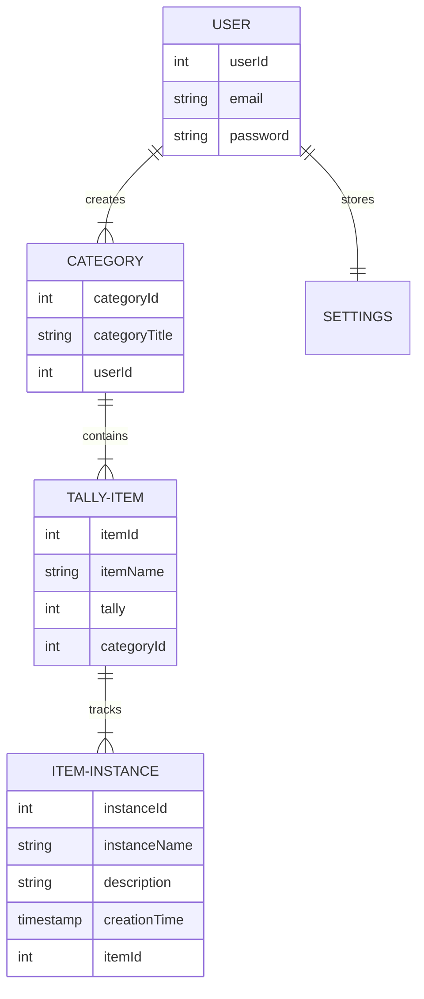

# Tallyman
A simple mobile application to track all the silly things in your life. 
Nothing special, just a way to tally up anything and everything you want to track. 
- Coffee Dates
- RPG Sessions Played
- Unique Beers Drank
- Plane Journeys

Flexible is the name of the game! 

## Functions

What does the app do? 

### Add Tally Category

These are big buckets that the user can add items to so that tallys can be kept under the same theme. 
These will be displayed on the main screen, holding information within them that can be expanded or collapsed. 
- User Taps the "Add New Category" Button
- New Category Screen Pops up 
- User enters details for the new category
- User returned to the home screen where they can now see the category!

Examples of common categories would be **Social**, **Fitness**, **Travel**, and so on. 

### Add Item to Tally

These are the things that the user wants to track, which are appended to the categories created by the user. 
- User Expands Category box, and then taps "Add New Item" Button
- User enters the details for the Item
- User is returned to the home screen and item is displayed under the category
- Behind the scenes, the first Tally Instance is created (more on that shortly) 

Examples of items that would come under social would be **Coffee Dates**, **Events Attended**, etc. 

### Increment Tally

With an item created, the user can increase the number of times that event has happened. 
This is done from the category box using a simple button to increase the count. 

- User expands a category, and hits the *+* button
- Tally updated to the new number for that item
- Behind the scenes, an instance of the tally item is created behind the scenes with the date default to the time entered

### Decrement Tally

Same process as the previous function, with one additional check in place. 

- User expands a category, and hits the *-* button
- Tally updated to the new number for that item
- Behind the scenes, an instance of the tally item is deleted (most recent)
- **NOTE**, if the latest instance of a tally item has optional data (name, description) entered into it - ask the user to confirm if they want to delete it

### Item Tally Details

The user can check to see the details of each instance of a tally.
Basically, if you have 5 coffee dates marked, then there will be 5 instances within that tally you can view in a detail page.

- User hits the Arrow icon next to a tally item
- Item Instance details screen shown
- User can edit each of these instances

Instances are meant to be lightweight and thus the only data entered by default is a creation timestamp
If the user performs the decrement function, the most recently created instance will be checked.
If the instance has been edited (title, description, or default date changed) then the user will have to confirm the deletion

## ER Diagrams

